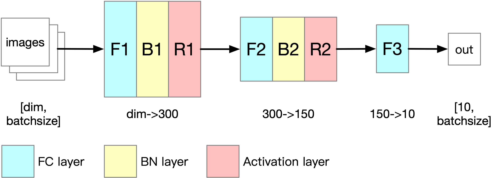

# NNforMNIST
A fully connected neural network for MNIST classification, implemented by Python 3.5 and Numpy.   

__Author__: Mingqi Gao, Chongqing University  
__Homepage__: [https://mingqigao.com](https://mingqigao.com)  
__Email__: gaomingqi@cqu.edu.cn, im.mingqi@gmail.com  

>__Figure__. The architecture of implemented neural network, where dim is the number of the pixels in a MNIST image (i.e. width x height).

### Requirements: 
- Python 3.5  
- Numpy  

### Description:

| Filename | Description |
| :------ | :------ |
|`dataloader.py` | Dataloader for MNIST dataset|  
|`main.py` | Entry point for this project|  
|`network.py` | Implementation for the proposed network|  
|`model` | Parameters obtained by training process|  
|`TRAIN_DATA.npy` | Meta-data created by training process (epoch, iteration, accuracy, loss)|

### Training:
Uncomment and run `train()` in `main.py`. The updated weights and parameters will be saved in `'model'` folder.

### Testing:
Uncomment and run `test()` in `main.py` to obtain the classification accuracy on test set.  
You can also run `test10RandomImgs()` to check classification results for 10 random images through graphic interface.
